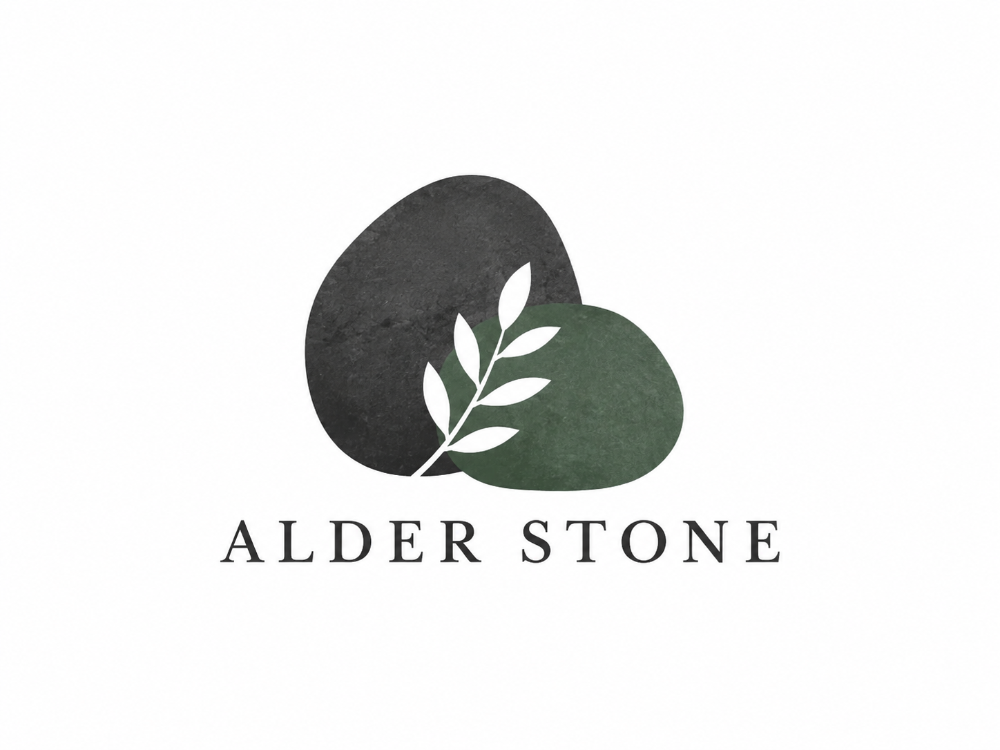

# Alder Stone — WordPress + ACF Portfolio Theme



A custom WordPress child theme built as a portfolio case study for an architecture studio. It combines a restrained editorial design system with Advanced Custom Fields (ACF), reusable page templates and a secure custom inquiry flow.

## What this project demonstrates

- Custom Understrap child-theme development with a tailored Sass design system.
- ACF field groups registered in PHP, so content structure is version-controlled.
- Flexible Home, Services, About and Contact pages managed through ACF.
- A `project` custom post type with archive and long-form case-study templates.
- Project fields for scope, scale, challenge, response, outcome, gallery and testimonial.
- Accessible, server-validated contact form with nonce protection and a honeypot.
- Responsive layouts verified for desktop and mobile breakpoints.
- Theme-owned title, description and Open Graph metadata, plus a custom 404 page.

## Content editing

After activating ACF, edit the corresponding WordPress page to manage its content. The Projects menu contains the case studies; their ACF tabs separate summary information, story, gallery and testimonial fields.

## Local setup

1. Install WordPress and the Understrap parent theme.
2. Copy this theme into `wp-content/themes/` and activate **Alder Stone**.
3. Install and activate **Advanced Custom Fields**.
4. Create pages with the slugs `services`, `about` and `contact`; assign a static front page.
5. Create Projects from the WordPress admin and add a featured image and ACF fields.

## Development

```bash
npm install
npm run dist
```

The build creates the standard child-theme assets plus page-scoped stylesheets for Contact, Projects and the 404 page. The Understrap parent theme must remain installed.

## Stack

WordPress · PHP · ACF · Understrap / Bootstrap 5 · Sass · PostCSS · Rollup

## License

GPL-3.0. See [LICENSE](../LICENSE).
